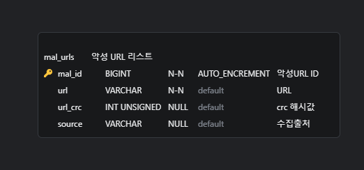

# 🚀 MAL_URL_COLLECTOR

**MAL_URL_COLLECTOR**는 악성 URL을 수집하고 데이터베이스에 저장하는 Python 기반 웹 크롤러 프로젝트입니다.  
이 프로젝트는 자동화된 방식으로 악성 URL 데이터를 수집하여, 데이터를 MySQL 데이터베이스에 저장합니다.

---

## 📂 **프로젝트 구조**

```
MAL_URL_COLLECTOR/ 
│ 
├── app/ 
│ ├── db.py # MySQL 연결 및 데이터 삽입 로직 
│ │
│ ├── logger.py # 로그 설정 파일 
│ │
│ ├── crawler.py # 크롤러
│ │
│ └── log/ # 크롤러 실행 로그 저장  
│   └── Collection_{date}.log # 일자별 로그 파일
│
├── config/ 
│   │ 
│   └── .env # 환경 변수 파일 (DB 연결 정보) 
│ 
├── requirements.txt # 필요한 Python 패키지 목록 
├── README.md # 프로젝트 설명서 
└── .gitignore # Git 관리에서 제외할 파일 목록
```

---

## ⚙️ **기능 설명**

### 🔒 1️⃣ **환경 변수 관리**
- 데이터베이스 연결 정보는 `.env` 파일에서 관리됩니다.
- `dotenv` 라이브러리를 통해 환경변수를 로드합니다.

### 🌐 2️⃣ **악성 URL 수집**
- `mal_url_crawler.py` 파일은 두 개의 외부 소스에서 악성 URL을 수집합니다:
  - 🔗 **NolaDefense**: [https://www.noladefense.net/](https://www.noladefense.net/)  
    예시 일일 피싱 URL 수집
  - 🔗 **OpenPhish**: [https://raw.githubusercontent.com/openphish/public_feed/refs/heads/main/feed.txt](https://raw.githubusercontent.com/openphish/public_feed/refs/heads/main/feed.txt)  
    최신 피싱 URL 목록 수집

### 🗄️ 3️⃣ **데이터베이스 저장**
- `db.py` 파일에서 MySQL 데이터베이스에 연결합니다.
- 수집된 악성 URL은 중복 검사를 거쳐 삽입됩니다.

### 📊 4️⃣ **로그 기록**
- 수집 및 삽입 과정을 실시간으로 로깅하여 `/log` 디렉토리에 저장합니다.

### 🕒 5️⃣ **정기 실행 기능 (크론탭)**
- `crontab` 파일을 통해 주기적으로 크롤러를 실행할 수 있습니다.
- 원하는 주기로 스케줄링 설정이 가능합니다.
- 매일 9시에 실행
```bash
crontab -e # crontab 진입

# m h  dom mon dow   command
# Mal URL Collector
0 9 * * * python {파일경로}/crawler.py
```

---

## 📑 1. **DB 설계**


### mal_urls
```SQL
create table mal_urls
(
    mal_id    int auto_increment
        primary key,
    url       varchar(2048)                       not null,
    url_crc   int unsigned                        null,
    source    varchar(255)                        not null,
    create_dt timestamp default CURRENT_TIMESTAMP null
);
```